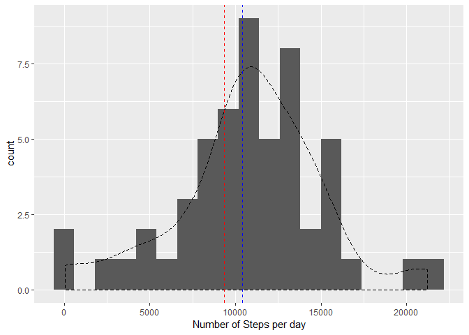

## Load up all dependencies and set global variables

```r
library(knitr)
library(dplyr)
library(xtable)
library(datasets)
library(ggplot2)
library(tcltk)

opts_chunk$set(message=FALSE, warning=FALSE, fig.path = "figs/fig-")
```

## Load and preprocess the data

```r
df <- read.csv(unz("activity.zip","activity.csv"))
df$date <- as.Date.factor(df$date)
print(xtable(head(df)), type = 'html')
```

<!-- html table generated in R 3.6.0 by xtable 1.8-4 package -->
<!-- Sun Jul 14 03:33:59 2019 -->
<table border=1>
<tr> <th>  </th> <th> steps </th> <th> date </th> <th> interval </th>  </tr>
  <tr> <td align="right"> 1 </td> <td align="right">  </td> <td align="right"> 15614.00 </td> <td align="right">   0 </td> </tr>
  <tr> <td align="right"> 2 </td> <td align="right">  </td> <td align="right"> 15614.00 </td> <td align="right">   5 </td> </tr>
  <tr> <td align="right"> 3 </td> <td align="right">  </td> <td align="right"> 15614.00 </td> <td align="right">  10 </td> </tr>
  <tr> <td align="right"> 4 </td> <td align="right">  </td> <td align="right"> 15614.00 </td> <td align="right">  15 </td> </tr>
  <tr> <td align="right"> 5 </td> <td align="right">  </td> <td align="right"> 15614.00 </td> <td align="right">  20 </td> </tr>
  <tr> <td align="right"> 6 </td> <td align="right">  </td> <td align="right"> 15614.00 </td> <td align="right">  25 </td> </tr>
   </table>

## What is mean total number of steps taken per day?
#### Apply 'sum' to each unique 'date' entry in the dataset

```r
sums <- tapply(df$steps, df$date, sum, na.rm = TRUE)
bwd <- 1200
```
#### Plot a histogram showing the frequency distribution of the number of steps per day

```r
data_frame(val = sums[sums > 0]) %>% ggplot(.,aes(sums[sums > 0]),)+geom_histogram(binwidth = bwd)+ geom_density(aes(y = bwd*..count..), linetype = "dashed")+xlab("Number of Steps per day")+geom_vline(xintercept = mean(sums), linetype = "dashed", col = "red")+geom_vline(xintercept = median(sums), linetype = "dashed", col = "blue")
```

<!-- -->

```r
print(summary(sums)[3:4])
```

```
##   Median     Mean 
## 10395.00  9354.23
```
## What is the average daily activity pattern?
#### Apply 'mean' to each unique 'interval' entry in the dataset

```r
avg_steps <- tapply(df$steps, as.factor(df$interval), mean, na.rm = TRUE)
```
#### Plot a time series showing ```Average Number of Steps ~ Interval of the Day```

```r
means <- data.frame(cbind(avg_steps,unique(df$interval)))
names(means) <- c("avg_steps", "interval")
means %>% ggplot(.,aes(y =avg_steps, x=interval))+geom_line(ch = 4)+geom_smooth(col = "red", linetype = "dashed")+ylim(0,max(avg_steps))+ylab("Average No. of Steps")
```

<!-- -->

```r
max <- means$interval[which.max(avg_steps)]
```

On average, the **835th** interval shows the most amount of activity.

## Imputing missing values
The next step is going to be a lengthy one. The Progress bar was a gesture on behalf of the author saying "I care about your patience and won't leave you waiting while my inefficient code runs in the background"

#### Set up the Progressbar to load before the document.

```r
max <- sum(is.na(df$steps))
pb <- tkProgressBar(title = "Imputing missing data...",min = 0, max = max)
```

#### Devise a strategy to impute values based on the distribution (assumed as Normal) of similar, yet known, values already existing within the dataset. 
* Locate all entries with missing values
* Find entries with:
   1. The same **day of the week**
   2. The same **5-minute interval**
* Find the **mean** and **standard deviation** of this set of similar values
* Impute values picked from a **Normal Distribution** with the same mean and standard deviation. 

This would preserve the uniqueness of each day and interval while also reserving an element of randomness to realistically simulate the device measurements.

```r
sim_df <- df
set.seed(20160215)
i <- 0
for (row in which(is.na(df$steps))){
        data <- as.vector(df[row,])
        mu <- mean(df[weekdays(as.Date(df$date)) == weekdays(data[[2]]) & df$interval == data[[3]],1], na.rm = TRUE)
        sig <- sd(df[weekdays(as.Date(df$date)) == weekdays(data[[2]]) & df$interval == data[[3]],1], na.rm = TRUE)
        if (is.na(mu) | is.na(sig)){
                data[1] <- 0.0
        } else{
        data[1] <- rnorm(1,mu, sig)
        }
        sim_df[row,] <- data
        i<-i+1
        setTkProgressBar(pb, i, label = paste(round(i/max*100, 0),"% done"))
}
close(pb)
```

#### Let's confirm if our new dataframe has any missing values remaining

```r
sum(is.na(sim_df$steps))
```

```
## [1] 0
```

#### With that out of the way, let's now compare the imputed data with the original by plotting the histogram again.

```r
n_sums <- tapply(sim_df$steps, sim_df$date, sum)
bwd <- 1200

data_frame(val = n_sums[n_sums > 0]) %>% ggplot(.,aes(n_sums[n_sums > 0]),)+geom_histogram(binwidth = bwd)+ geom_density(aes(y = bwd*..count..), linetype = "dashed")+xlab("Number of Steps per day")+geom_vline(xintercept = mean(n_sums), linetype = "dashed", col = "red")+geom_vline(xintercept = median(n_sums), linetype = "dashed", col = "blue")
```

<!-- -->

```r
print(summary(n_sums)[3:4])
```

```
##   Median     Mean 
## 11068.95 10894.29
```


We notice that imputing the missing data made the overall distribution less skewed (recall our "Normally distibuted" assumption). As a result, the mean and median also seem to be more closely positioned this time. The magnitude of this change owes to the fact that a good **13.1147541%** of the data in the df was calculated as missing and, therefore, was replaced by our symmetrically generated simulated data.

## Are there differences in activity patterns between weekdays and weekends?
#### Start by implementing `dplyr`s `mutate` to add a column that categorizes weekdays and weekends. 

```r
sim_df <- sim_df %>% mutate(day_type = if_else(weekdays(date) %in% c("Saturday", "Sunday"), "Weekend", "Weekday"))
sim_df$day_type <- as.factor(sim_df$day_type)
```
#### Compute the average number of steps of each day

```r
means <- sim_df %>% group_by(interval,day_type) %>% summarise(mean(steps))
names(means) <- c("interval", "day_type", "avg_steps")
```
#### Plot a time series showing ```Average Number of Steps ~ Interval of the Day | Type of the Day```

```r
means %>% ggplot(.,aes(y =avg_steps, x=interval))+geom_line(ch = 4)+geom_smooth(col = "red", linetype = "dashed")+facet_grid(.~day_type)+ylab("Average No. of Steps")
```

<!-- -->

This is rather interesting. As expected, we see activity concentrated more during the early hours of the day on weekdays as people often tend to have routine walks/jogs/work-outs before their commute. Two distinct peaks can be noticed before the 1000-mark which might mark the beginning of office hours and right before the 2000-mark, which would, in turn, mark the end of them.

On the other hand, the activity during weekends seems to have been pushed down the daily timeline and is also spread relatively evenly (albeit noisily) across the day. This is likely due to the fact that people tend to wake up late during weekends and follow no set walking/jogging routine. This causes the distribution to lose its distinct bimodality and appear more smeared out as a result.

#### Hope this study was helpful for you and thanks for the time! :)
